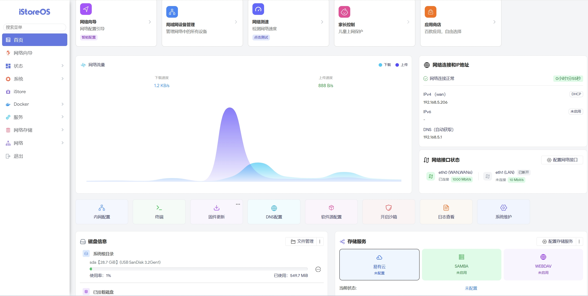
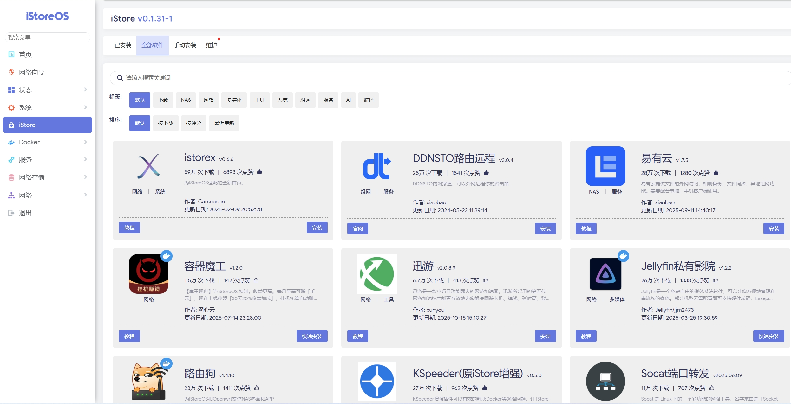
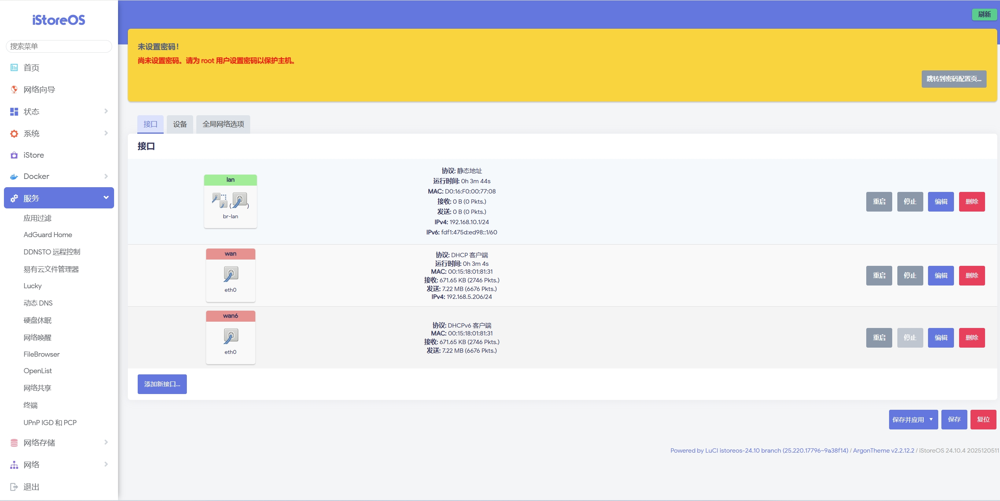

  
  <h1>基于iStoreOS Imagebuilder X86-64</h1>
  
  
  
  
  

  
  
  
  
  
  
  

---

## 🤔 项目介绍 
**目标是提供一个纯净的iStoreOS系统** 
***编译快速，基本上10分钟就可以完成编译工作。***

> [!TIP]
> 😂此固件为 **非官方构建，不保证完全无BUG** ，请知悉😂
> 

## 🤗 项目截图 

## 🌟 Star戳一戳，好运加满！😆
> **"点过 `Star` 的朋友，颜值与智慧双双在线！✨"**
> 
> **"您的每一个⭐️，都是开源土壤里的一缕阳光，让灵感发芽，让创造生长~"**

## 🎉 Thanks 
- [istoreos](https://github.com/istoreos/istoreos)
- [Wukongdaily](https://github.com/wukongdaily/istoreos-builder)

## 🙏 免责声明 
- 📚 本固件仅供学习研究，严禁用于任何商业用途
- 🤝 使用本固件产生的所有后果均由使用者自行承担
- ⚠️ 固件仍可能存在缺陷，开发者不提供任何形式的技术支持
- 📜 请严格遵守国家网络安全法律法规，合法使用

